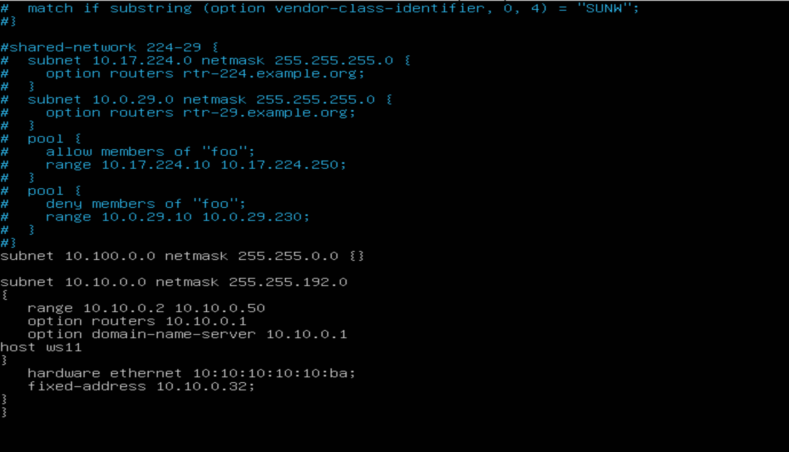

## Part 1. Инструмент **ipcalc**

**== Задание ==**

##### Подними виртуальную машину (далее -- ws1)

#### 1.1. Сети и маски
##### Определи и запиши в отчёт:
##### 1) Адрес сети *192.167.38.54/13*
- Установил утилиту `ipcalc`
 
- Адрес сети *192.167.38.54/13*
  
##### 2) Перевод маски *255.255.255.0* в префиксную и двоичную запись
 
#### */15* в обычную и двоичную

#### *11111111.11111111.11111111.11110000* в обычную и префиксную


##### 3) Минимальный и максимальный хост в сети *12.167.38.4* при масках: */8*

#### *11111111.11111111.00000000.00000000*

#### *255.255.254.0*

#### */4*


#### 1.2. localhost
##### Определи и запиши в отчёт, можно ли обратиться к приложению, работающему на localhost, со следующими IP: 

#### *194.34.23.100* - Нельзя
 
#### *127.0.0.2* - Можно

#### *127.1.0.1* - Нельзя

#### *128.0.0.1* - Можно

Так как localhost находится в диапазоне 127.0.0.1 — 127.255.255.254


#### 1.3. Диапазоны и сегменты сетей
##### Определи и запиши в отчёт:
##### 1) Какие из перечисленных IP можно использовать в качестве публичного, а какие только в качестве частных: *10.0.0.45*, *134.43.0.2*, *192.168.4.2*, *172.20.250.4*, *172.0.2.1*, *192.172.0.1*, *172.68.0.2*, *172.16.255.255*, *10.10.10.10*, *192.169.168.1*

*  10.0.0.45 - Частный адрес (входит в диапазон 10.x.x.x)
*  192.168.4.2 - Частный адрес (входит в диапазон 192.168.x.x)
*  172.20.250.4 - Частный адрес (входит в диапазон 172.16.x.x до 172.31.x.x)
*  172.16.255.255 - Частный адрес (входит в диапазон 172.16.x.x до 172.31.x.x)
*  10.10.10.10 - Частный адрес (входит в диапазон 10.x.x.x)

***Публичные IP-адреса*** - доступны в Интернете и уникальны для каждого устройства или сервиса, подключенного к глобальной сети:

*  134.43.0.2 - Публичный адрес
*  172.0.2.1 - Публичный адрес
*  192.172.0.1 - Публичный адрес
*  172.68.0.2 - Публичный адрес
*  1921691681 - Публичный адрес

##### 2) Какие из перечисленных IP-адресов шлюза возможны у сети *10.10.0.0/18*: *10.0.0.1*, *10.10.0.2*, *10.10.10.10*, *10.10.100.1*, *10.10.1.255*

Подходящие адреса:
* 10.10.0.2
* 10.10.10.10
10.10.1.255*
Неподходящие адреса:
* 10.0.0.1
* 10.10.100.1*

Диапозон:


## Part 2. Статическая маршрутизация между двумя машинами

`-` Теперь разберёмся, как связать две машины, используя статическую маршрутизацию.

**== Задание ==**

##### Подними две виртуальные машины (далее -- ws1 и ws2).

##### С помощью команды `ip a` посмотри существующие сетевые интерфейсы.
- В отчёт помести скрин с вызовом и выводом использованной команды.
  
  
##### Опиши сетевой интерфейс, соответствующий внутренней сети, на обеих машинах и задай следующие адреса и маски: ws1 — *192.168.100.10*, маска */16*, ws2 — *172.24.116.8*, маска */12*.
`link/ether 08:00:27:c8:8a:a0 brd ff:ff:ff:ff:ff:ff`

link/ether 08:00:27:c8:8a:a0: Это MAC-адрес (физический адрес) интерфейса enp0s3.
brd ff:ff:ff:ff:ff:ff: Это широковещательный адрес для Ethernet-сети.

`inet 10.0.2.15/24 brd 10.0.2.255 scope global enp0s3`

inet 10.0.2.15/24: Это IPv4-адрес, назначенный интерфейсу. 10.0.2.15 — это IP-адрес, а /24 — маска подсети (255.255.255.0).

`brd 10.0.2.255:` Широковещательный адрес для этой подсети.

`scope global`: Это глобальный адрес, доступный для всех устройств в сети.

`inet6 fe80::a00:27ff:fec8:8aa0/64 scope link`

`inet6 fe80::a00:27ff:fec8:8aa0/64`: Это IPv6-адрес, назначенный интерфейсу, используемый для связи в пределах локальной сети.

`scope link`: Этот адрес используется только на уровне сети (link-local), то есть не доступен за пределами локальной сети.

`valid_lft forever preferred_lft forever`

valid_lft forever: Адрес действителен бессрочно.

`preferred_lft forever:` Адрес предпочтителен бессрочно.

- В отчёт помести скрины с содержанием изменённого файла *etc/netplan/00-installer-config.yaml* для каждой машины.
 

##### Выполни команду `netplan apply` для перезапуска сервиса сети.
- В отчёт помести скрин с вызовом и выводом использованной команды.
 

#### 2.1. Добавление статического маршрута вручную
##### Добавь статический маршрут от одной машины до другой и обратно при помощи команды вида `ip r add`.


##### Пропингуй соединение между машинами.
- В отчёт помести скрин с вызовом и выводом использованных команд.

#### 2.2. Добавление статического маршрута с сохранением
##### Добавь статический маршрут от одной машины до другой с помощью файла */etc/netplan/00-installer-config.yaml*.
- В отчёт помести скрин с содержанием изменённого файла */etc/netplan/00-installer-config.yaml*.

##### Пропингуй соединение между машинами.
- В отчёт помести скрин с вызовом и выводом использованной команды.

## Part 3. Утилита **iperf3**

**== Задание ==**

*В данном задании используются виртуальные машины ws1 и ws2 из Части 2*

#### 3.1. Скорость соединения
##### Переведи и запиши в отчёт: 8 Mbps в MB/s, 100 MB/s в Kbps, 1 Gbps в Mbps.
8 Mbps = 1 MB/s (8 мегабит в секунду = 1 мегабайт в секунду)

100 MB/s = 800,000 Kbps (100 мегабайт в секунду = 800,000 килобит в секунду)

1 Gbps = 1,000 Mbps (1 гигабит в секунду = 1,000 мегабит в секунду)
#### 3.2. Утилита **iperf3**i
##### Измерь скорость соединения между ws1 и ws2.
- В отчёт помести скрины с вызовом и выводом использованных команд.дд

## Part 4. Сетевой экран

`-` После соединения машин перед нами стоит следующая задача: контролировать информацию, проходящую по соединению. Для этого используются сетевые экраны.


**== Задание ==**

*В данном задании используются виртуальные машины ws1 и ws2 из Части 2*

#### 4.1. Утилита **iptables**
##### Создай файл */etc/firewall.sh*, имитирующий файрвол, на ws1 и ws2:
```shell
#!/bin/sh

# Удаление всех правил в таблице «filter» (по умолчанию).
iptables -F
iptables -X
```
##### Нужно добавить в файл подряд следующие правила:
##### 1) На ws1 примени стратегию, когда в начале пишется запрещающее правило, а в конце пишется разрешающее правило (это касается пунктов 4 и 5).
##### 2) На ws2 примени стратегию, когда в начале пишется разрешающее правило, а в конце пишется запрещающее правило (это касается пунктов 4 и 5).
##### 3) Открой на машинах доступ для порта 22 (ssh) и порта 80 (http).
##### 4) Запрети *echo reply* (машина не должна «пинговаться», т. е. должна быть блокировка на OUTPUT).
##### 5) Разреши *echo reply* (машина должна «пинговаться»).
- В отчёт помести скрины с содержанием файла */etc/firewall* для каждой машины.

##### Запусти файлы на обеих машинах командами `chmod +x /etc/firewall.sh` и `/etc/firewall.sh`.
- В отчёт помести скрины с запуском обоих файлов.

- В отчёте опиши разницу между стратегиями, применёнными в первом и втором файлах.
   
   Команды выполняются по порядку. Поэтому в ws1 пинг будет запрещен(потому что разрешение стоит после запрещения), а в ws2 будет разрешен, так как разрешение стоит первее.
  
#### 4.2. Утилита **nmap**
##### Командой **ping** найди машину, которая не «пингуется», после чего утилитой **nmap** покажи, что хост машины запущен.
*Проверка: в выводе nmap должно быть сказано: `Host is up`*.
- В отчёт помести скрины с вызовом и выводом использованных команд **ping** и **nmap**.

  
  
  

## Part 5. Статическая маршрутизация сети

`-` Пока что мы соединяли всего две машины, но теперь пришло время для статической маршрутизации целой сети.

**== Задание ==**

Сеть: \

##### Подними пять виртуальных машин (3 рабочие станции (ws11, ws21, ws22) и 2 роутера (r1, r2)).

#### 5.1. Настройка адресов машин
##### Настрой конфигурации машин в *etc/netplan/00-installer-config.yaml* согласно сети на рисунке.
- В отчёт помести скрины с содержанием файла *etc/netplan/00-installer-config.yaml* для каждой машины.


##### Перезапусти сервис сети. Если ошибок нет, командой `ip -4 a` проверь, что адрес машины задан верно. Также пропингуй ws22 с ws21. Аналогично пропингуй r1 с ws11.
- В отчёт помести скрины с вызовом и выводом использованных команд.

`cat:`


`ping: `

#### 5.2. Включение переадресации IP-адресов
##### Для включения переадресации IP выполни команду на роутерах:
`sysctl -w net.ipv4.ip_forward=1`

*При таком подходе переадресация не будет работать после перезагрузки системы.*
- В отчёт помести скрин с вызовом и выводом использованной команды.
##### Открой файл */etc/sysctl.conf* и добавь в него следующую строку:
`net.ipv4.ip_forward = 1`

*При использовании этого подхода, IP-переадресация включена на постоянной основе.*
- В отчёт помести скрин с содержанием изменённого файла */etc/sysctl.conf*.

#### 5.3. Установка маршрута по умолчанию
Пример вывода команды `ip r` после добавления шлюза:
```
default via 10.10.0.1 dev eth0
10.10.0.0/18 dev eth0 proto kernel scope link src 10.10.0.2
```

##### Настрой маршрут по умолчанию (шлюз) для рабочих станций. Для этого добавь `default` перед IP-роутера в файле конфигураций.
##### Вызови `ip r` и покажи, что добавился маршрут в таблицу маршрутизации.
- В отчёт помести скрин с содержанием файла *etc/netplan/00-installer-config.yaml*;
- В отчёт помести скрин с вызовом и выводом использованной команды.


##### Пропингуй с ws11 роутер r2 и покажи на r2, что пинг доходит. Для этого используй команду:
`tcpdump -tn -i eth0`
- В отчёт помести скрин с вызовом и выводом использованных команд.

  

#### 5.4. Добавление статических маршрутов
##### Добавь в роутеры r1 и r2 статические маршруты в файле конфигураций. Пример для r1 маршрута в сетку 10.20.0.0/26:
```shell
# Добавь в конец описания сетевого интерфейса eth1:
- to: 10.20.0.0
  via: 10.100.0.12
```

- В отчёт помести скрины с содержанием изменённого файла *etc/netplan/00-installer-config.yaml* для каждого роутера.
##### Вызови `ip r` и покажи таблицы с маршрутами на обоих роутерах. Пример таблицы на r1:
```
10.100.0.0/16 dev eth1 proto kernel scope link src 10.100.0.11
10.20.0.0/26 via 10.100.0.12 dev eth1
10.10.0.0/18 dev eth0 proto kernel scope link src 10.10.0.1
```
- В отчёт помести скрин с вызовом и выводом использованной команды.


##### Запусти команды на ws11:
`ip r list 10.10.0.0/[маска сети]` и `ip r list 0.0.0.0/0`
- В отчёт помести скрин с вызовом и выводом использованных команд;
- В отчёте объясни, почему для адреса 10.10.0.0/\[маска сети\] был выбран маршрут, отличный от 0.0.0.0/0, хотя он попадает под маршрут по умолчанию.


Маршрут 10.10.0.0/18 более специфичен, чем маршрут по умолчанию (0.0.0.0/0), поэтому он имеет приоритет.

Был выбран первый, так как он прописал в нетпане+выбирается тот вариант, где маска длиннее

Для адреса 10.10.0.0/18 был выбран маршрут, отличный от 0.0.0.0/0, поскольку он является адресом сети и доступен без шлюза.

#### 5.5. Построение списка маршрутизаторов
Пример вывода утилиты **traceroute** после добавления шлюза:
```
1 10.10.0.1 0 ms 1 ms 0 ms
2 10.100.0.12 1 ms 0 ms 1 ms
3 10.20.0.10 12 ms 1 ms 3 ms
```
##### Запусти на r1 команду дампа:
`tcpdump -tnv -i eth0`

##### При помощи утилиты **traceroute** построй список маршрутизаторов на пути от ws11 до ws21.
- В отчёт помести скрины с вызовом и выводом использованных команд (tcpdump и traceroute);

- В отчёте, опираясь на вывод, полученный из дампа на r1, объясни принцип работы построения пути при помощи **traceroute**.

traceroute отправляет ICMP-пакет на конечный узел.

В пакете есть поле TTL (Time To Live, "время жизни"), которое показывает, сколько маршрутизаторов (роутеров) может пройти пакет.
Первый пакет отправляется с TTL = 1:

Первый маршрутизатор уменьшает TTL на 1 (TTL = 0).
Когда TTL становится 0, маршрутизатор не может переслать пакет дальше.
Он отправляет отправителю ICMP-сообщение "time exceeded in transit" (время жизни истекло).
traceroute фиксирует IP-адрес этого маршрутизатора.
Второй пакет отправляется с TTL = 2:
Первый маршрутизатор уменьшает TTL на 1 (TTL = 1) и передает дальше.
Второй маршрутизатор уменьшает TTL на 1 (TTL = 0) и отправляет "time exceeded in transit".
traceroute фиксирует IP второго маршрутизатора.
Этот процесс повторяется, пока пакет не дойдет до конечного узла.

Как traceroute понимает, что достиг цели?

traceroute использует не ICMP-пакеты, а UDP (по умолчанию).
UDP-пакет отправляется на неиспользуемый порт (33434 + N).
Когда он достигает конечного узла, он не знает, что с ним делать, и отправляет обратно ICMP "порт недоступен".
traceroute понимает, что это конечная точка, и завершает трассировку.

#### 5.6. Использование протокола **ICMP** при маршрутизации
##### Запусти на r1 перехват сетевого трафика, проходящего через eth0 с помощью команды:
`tcpdump -n -i eth0 icmp`
##### Пропингуй с ws11 несуществующий IP (например, *10.30.0.111*) с помощью команды:
`ping -c 1 10.30.0.111`
- В отчёт помести скрин с вызовом и выводом использованных команд.
  
##### Сохрани дампы образов виртуальных машин.
**P.S. Ни в коем случае не сохраняй дампы в гит!**

## Part 6. Динамическая настройка IP с помощью **DHCP**

`-` Следующим нашим шагом будет более подробное знакомство со службой **DHCP**, которую ты уже знаешь.

**== Задание ==**

*В данном задании используются виртуальные машины из Части 5.*

##### Для r2 настрой в файле */etc/dhcp/dhcpd.conf* конфигурацию службы **DHCP**:
##### 1) Укажи адрес маршрутизатора по умолчанию, DNS-сервер и адрес внутренней сети. Пример файла для r2:
```shell
subnet 10.100.0.0 netmask 255.255.0.0 {}

subnet 10.20.0.0 netmask 255.255.255.192
{
    range 10.20.0.2 10.20.0.50;
    option routers 10.20.0.1;
    option domain-name-servers 10.20.0.1;
}
```
##### 2) В файле *resolv.conf* пропиши `nameserver 8.8.8.8`.
- В отчёт помести скрины с содержанием изменённых файлов.

  

  

##### Перезагрузи службу **DHCP** командой `systemctl restart isc-dhcp-server`. Машину ws21 перезагрузи при помощи `reboot` и через `ip a` покажи, что она получила адрес. Также пропингуй ws22 с ws21.
- В отчёт помести скрины с вызовом и выводом использованных команд.

  
  
  До:

  

  После:

  

  ping с ws21 на ws22:

  

##### Укажи MAC-адрес у ws11, для этого в *etc/netplan/00-installer-config.yaml* надо добавить строки: `macaddress: 10:10:10:10:10:BA`, `dhcp4: true`.
- В отчёт помести скрин с содержанием изменённого файла *etc/netplan/00-installer-config.yaml*.
##### Для r1 настрой аналогично r2, но сделай выдачу адресов с жесткой привязкой к MAC-адресу (ws11). Проведи аналогичные тесты.
- В отчёте этот пункт опиши аналогично настройке для r2.
  настройка DHCP:
  

  DNS:

  
  
  

##### Запроси с ws21 обновление IP-адреса.
- В отчёте помести скрины IP до и после обновления.
  ip до обновления:
  
  
  ip после:

  


- В отчёте опиши, какими опциями **DHCP** сервера пользовался в данном пункте:

  `sudo dhclient -r enp0s3` освобождает текущий адрес интерфейса enp0s3. 
  
  `sudo dhclient enp0s3` задает новый адрес указанному интерфейсу.

## Part 7. **NAT**
`-` Ну и в конце в качестве вишенки на торте я расскажу тебе про механизм преобразования адресов.

**== Задание ==**

*В данном задании используются виртуальные машины из Части 5.*
##### В файле */etc/apache2/ports.conf* на ws22 и r1 измени строку `Listen 80` на `Listen 0.0.0.0:80`, то есть сделай сервер Apache2 общедоступным.
- В отчёт помести скрин с содержанием изменённого файла.
  
  
  
##### Запусти веб-сервер Apache командой `service apache2 start` на ws22 и r1.

- В отчёт помести скрины с вызовом и выводом использованной команды.

  


##### Добавь в фаервол, созданный по аналогии с фаерволом из Части 4, на r2 следующие правила:
##### 1) Удаление правил в таблице filter — `iptables -F`;
##### 2) Удаление правил в таблице «NAT» — `iptables -F -t nat`;
##### 3) Отбрасывать все маршрутизируемые пакеты — `iptables --policy FORWARD DROP`.
##### Запусти файл также, как в Части 4.
##### Проверь соединение между ws22 и r1 командой `ping`.
*При запуске файла с этими правилами, ws22 не должна «пинговаться» с r1.*
- В отчёт помести скрины с вызовом и выводом использованной команды.

  

  

##### Добавь в файл ещё одно правило:
##### 4) Разрешить маршрутизацию всех пакетов протокола **ICMP**.
##### Запусти файл также, как в Части 4.
##### Проверь соединение между ws22 и r1 командой `ping`.
*При запуске файла с этими правилами, ws22 должна «пинговаться» с r1.*
- В отчёт помести скрины с вызовом и выводом использованной команды.
  
  

  
  
##### Добавь в файл ещё два правила:
##### 5) Включи **SNAT**, а именно маскирование всех локальных IPиз локальной сети, находящейся за r2 (по обозначениям из Части 5 — сеть 10.20.0.0).
*Совет: стоит подумать о маршрутизации внутренних пакетов, а также внешних пакетов с установленным соединением.*

  
##### 6) Включи **DNAT** на 8080 порт машины r2 и добавить к веб-серверу Apache, запущенному на ws22, доступ извне сети.
*Совет: стоит учесть, что при попытке подключения возникнет новое tcp-соединение, предназначенное ws22 и 80 порту.*
- В отчёт помести скрин с содержанием изменённого файла.
    
    

##### Запусти файл также, как в Части 4.
*Перед тестированием рекомендуется отключить сетевой интерфейс **NAT** (его наличие можно проверить командой `ip a`) в VirtualBox, если он включен.*
##### Проверь соединение по TCP для **SNAT**: для этого с ws22 подключиться к серверу Apache на r1 командой:
`telnet [адрес] [порт]`

  
  
##### Проверь соединение по TCP для **DNAT**: для этого с r1 подключиться к серверу Apache на ws22 командой `telnet` (обращаться по адресу r2 и порту 8080).
- В отчёт помести скрины с вызовом и выводом использованных команд.

  
##### Сохрани дампы образов виртуальных машин.
**P.S. Ни в коем случае не сохраняй дампы в гит!**

## Part 8. Дополнительно. Знакомство с **SSH Tunnels**

**== Задание ==**

*В данном задании используются виртуальные машины из Части 5.*

##### Запусти на r2 фаервол с правилами из Части 7.
```
sudo sh /etc/firewall.sh
```
##### Запусти веб-сервер **Apache** на ws22 только на localhost (то есть в файле */etc/apache2/ports.conf* измени строку `Listen 80` на `Listen localhost:80`).


##### Воспользуйся *Local TCP forwarding* с ws21 до ws22, чтобы получить доступ к веб-серверу на ws22 с ws21.


#### Воспользуйся *Remote TCP forwarding* c ws11 до ws22, чтобы получить доступ к веб-серверу на ws22 с ws11.


#### Для проверки, сработало ли подключение в обоих предыдущих пунктах, перейди во второй терминал (например, клавишами Alt + F2) и выполни команду:

`telnet 127.0.0.1 [локальный порт]`

